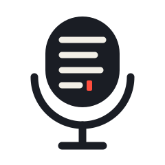

<p align="center">
  <picture>
    <source media="(prefers-color-scheme: dark)" srcset="assets/logo-dark.svg">
    
  </picture>
</p>

<h1 align="center">MicText</h1>

<p align="center">
  <em>Hold a key. Speak. Text appears — and your audio never leaves your machine.</em>
</p>

<p align="center">
  <a href="https://www.npmjs.com/package/mictext"></a>
  
  
</p>

<p align="center">
  <strong><a href="https://dieterstemmet.github.io/mictext/">▶ Try it in your browser</a></strong> — works on your phone too.
</p>

MicText is an embeddable STT library for the web plus reference
push-to-talk dictation clients for macOS and Windows, all running
[Whisper](https://github.com/ggml-org/whisper.cpp) locally. An optional
self-hosted fallback server covers devices too slow to run the model.

| Component | What it is |
| --- | --- |
| [`web/`](web/) | Browser library: Whisper in a Web Worker (WebGPU → WASM). Headless `createTranscriber()` core + `<mictext-mic>` element. `npm i mictext` |
| [`mac/`](mac/) | macOS dictation client: hold right-⌥, speak, release — text typed at the cursor (Hammerspoon + ffmpeg + whisper.cpp) |
| [`win/`](win/) | Windows dictation client: hold Right Ctrl (AutoHotkey v2 + ffmpeg + whisper.cpp) |
| [`server/`](server/) | Optional self-hosted fallback (FastAPI + faster-whisper) for the web library's explicit `slowDevice: 'server'` opt-in |

## Dictation behaviour

All three clients share the same behaviour, tuned per platform:

- **Warming vs. recording.** Opening the capture device takes up to a second on the first press of a session. Each client shows that as a distinct warming state — a dim pill and a `🎙…` icon on macOS, a grey pill and "warming up" tooltip on Windows, a `warming` attribute on `<mictext-mic>` — and only switches to the recording look once audio is genuinely being captured. Wait for it and no first words are lost.
- **Silence is silence.** A hold that carried no speech types nothing and shows nothing. Whisper's silence hallucinations (`[BLANK_AUDIO]`, `Thank you.`) are dropped too.
- **It learns your words.** Correct a transcript (⌥⇧F on macOS, Alt+Shift+F on Windows, `mic.learn()` on the web) and the pair is remembered in `~/.mictext/terms.json` — fed back to Whisper as decoding context and applied as a replacement. Local file, local only; the desktop clients share one file format.

## Zero-upload guarantee

With the default configuration, no code path in this repo POSTs your audio
anywhere. The web library only GETs model files (verified end-to-end with
full network logging — see [`web/README.md`](web/README.md)); the desktop
clients work with Wi-Fi off. The single exception is the web library's
`slowDevice: 'server'` opt-in, which sends audio to a fallback URL **you**
configure — typically your own `server/` deployment.

## Quick start

**Browser** — `npm i mictext`, then:

```js
import { createTranscriber } from 'mictext'
const t = createTranscriber()
const { text } = await t.transcribeBlob(audioBlob)
```

**macOS** — one line (then hold right-⌥ and speak):

```bash
curl -fsSL https://raw.githubusercontent.com/dieterstemmet/mictext/master/mac/install.sh | bash
```

**Windows** — one line in PowerShell (then hold Right Ctrl and speak):

```powershell
irm https://raw.githubusercontent.com/dieterstemmet/mictext/master/win/install.ps1 | iex
```

Configure mic, hotkey, and model from the tray **Settings...** menu, or `win\config.ps1` from a clone.

([mac/README.md](mac/README.md) / [win/README.md](win/README.md))

## On your phone

Mobile browsers don't allow system-wide dictation, so there's no
push-to-talk client for iOS/Android — but the web library runs fine on
phones (the default `whisper-tiny.en` model exists exactly for mobile
WebKit's memory limits):

- **Use the [hosted demo](https://dieterstemmet.github.io/mictext/)**: open
  it on your phone, hold the mic, speak, copy the text anywhere. "Add to
  Home Screen" gives it an app icon.
- **Embed it** in any web app with `<mictext-mic>` — see [`web/`](web/).
- System-wide mobile dictation would need a native keyboard app (iOS
  keyboard extension / Android IME) — a possible future direction.

## Design: headless core, swappable frontends

The durable interface is the headless transcriber
(`createTranscriber().transcribeBlob(blob)` on the web; `whisper-cli` behind
a hotkey on desktop). Dictation — "type what I said at the cursor" — is just
the first frontend. The same ears can feed a voice assistant: that's the
direction this project grows in, and why no client logic lives in the core.

## License

MIT
